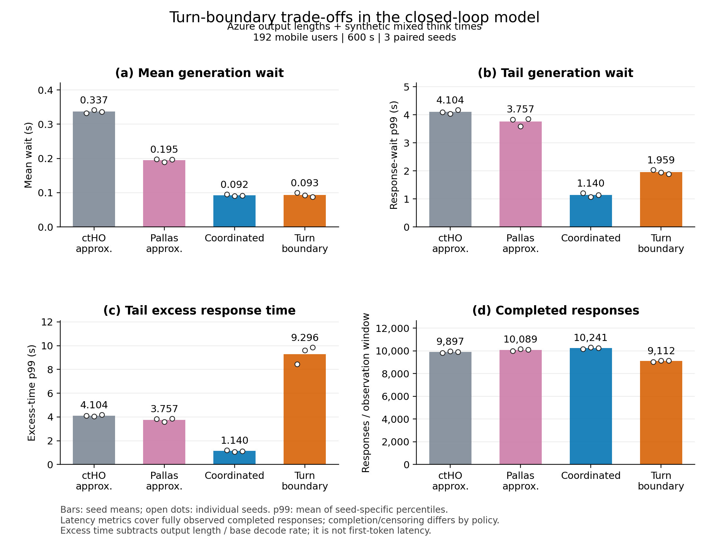
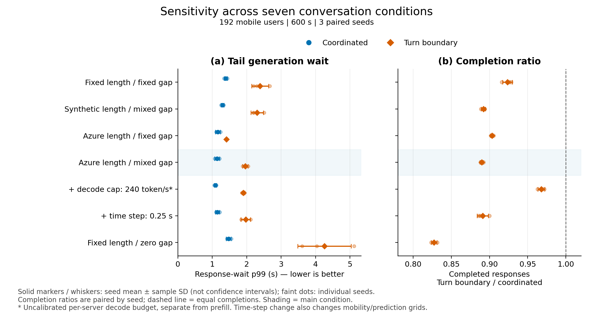

# MEC 이동 사용자 LLM 핸드오버에서 다중 사용자 KV 캐시의 선제 준비 시점 조율

> 팀 검토용 초안 v0.12 · 2026-09-21. MEC 이동성 환경의 시뮬레이션 연구이며 실제 시스템 검증 결과와 구분한다.
> [변경 이력](draft_history.md) · [알고리즘 구현 명세](coordination_algorithm.md) · [턴 경계 검증 상세](turn_boundary_validation.md) · [참고문헌](references.md)
> v0.12는 현재 구현과 주장 범위를 대조한 판이다. 실험 동작·수치는 새로 갱신하지 않았으며, 기존 최적성 격차는 비교 조건 정렬 전까지 보류한다.

## 초록

MEC 기반 LLM 서비스에서는 이동 사용자의 기지국 전환 전에 KV 캐시를 준비하더라도 여러 사용자가 같은 목표 서버에 몰리면 GPU·백홀 경합이 발생할 수 있다. 본 연구는 예측된 전환 데드라인 아래 여러 세션의 준비 시작 시점과 자원 점유를 공동 계획하는 조율형 스케줄러를 제안한다. 기존 다중 이전·대역폭 배분 연구와 달리 완전한 상태 복원을 위한 선제 준비의 시간 배치에 초점을 둔다. 공개 수치에 보정한 근사 시뮬레이터의 32–192명 플래툰 조건에서 비조율 Pallas 근사 대비 이전 사건별 평균 중단 시간을 15–53%, p99를 70–76% 줄였다. 턴 경계 이전이 조율을 대체하는지도 별도로 검증했다. 복구·전달 지연을 다음 턴에 반영하고 실측 응답 길이 표본과 합성 생각 시간을 적용한 주요 조건에서, 응답 대기 평균은 두 방식이 약 0.09초로 비슷했지만 p99는 조율형 1.140초, 턴 경계 1.959초였으며 턴 경계의 완료 응답 수는 11.02% 적었다. 7조건·3시드에서 꼬리 지연의 비교 방향이 유지되었다. 이는 평균 중단 시간만으로 턴 경계 이전의 대체 가능성을 판단하기 어렵다는 시뮬레이션 근거이며, 실측 생각 시간·GPU 혼합 실행·전체 메모리 제약의 검증은 남는다.

주제어: MEC, 이동성, LLM 서비스 연속성, KV 캐시 이전, 선제 준비 시점 조율

---

## 1. 서론

### 1-1. 연구 배경

멀티액세스 엣지 컴퓨팅(MEC)과 그 무선접속망 확장인 AI-RAN은 GPU를 기지국(gNB)에 병설하여 대규모 언어 모델(LLM) 서빙을 사용자 인접 지점으로 끌어온다 [survey1, survey2]. LLM 서빙은 기존 MEC의 상태 없는(stateless) 태스크 오프로딩과 근본적으로 다르다. LLM은 자기회귀적으로 토큰을 생성하며 지금까지의 문맥을 키-값 캐시(KV 캐시)라는 상태로 GPU 메모리에 유지한다. Qwen3-32B의 경우 토큰당 약 256 KiB, 4,000 토큰 문맥에서 약 1 GiB에 이르며, 이 상태는 디코딩이 진행되는 동안 매 토큰 계속 자란다 [pallas]. 사용자가 셀 경계를 넘어 서빙 gNB가 바뀌면(핸드오버) 상태는 원 서버에 남고 사용자는 새 서버에 붙으므로, 세션을 이어가려면 상태를 어떻게든 새 서버에 마련해야 한다.

### 1-2. 문제 제기: 엣지 KV 이전에서 이동 사용자 선제 준비로

엣지 서버 간 KV 캐시 이전과 다중 이전의 공동 최적화는 이미 연구되었다. EdgeFlow [edgeflow]는 서버 과부하·이탈에 따른 목적지 배정과 전송·재계산을 함께 최적화한다. 이동 사용자 환경의 ImpactHO [impactho]도 soft handover의 전송 창에서 정식 전환 전에 부분 KV를 적재할 수 있고, 여러 사용자에게 슬롯별 백홀 대역폭을 배분해 추론 정확도를 높인다. 그러므로 **전환 전 전송이나 다중 사용자 대역폭 조율 자체는 본 연구의 최초 기여가 아니다.** 본 연구의 질문은 예측된 전환 시각들을 데드라인으로 삼아, 완전한 KV 상태 복원에 필요한 타겟 GPU·링크 작업의 **시작 시점을 여러 세션 사이에서 어떻게 공동 계획할지**이다.

핸드오버 후 타겟에서 KV 캐시를 복원하는 방법은 세 가지 계열로 정리된다. 전량 전송(Full-Copy), 원본 토큰만 넘겨 타겟에서 prefill로 재계산(Recomputation), 그리고 둘을 결합하여 prefix는 재계산·suffix는 전송하고 다중 사용자 간 백홀 대역폭까지 함께 배분하는 ctHO [target]이다. 이들은 모두 **핸드오버가 일어난 뒤에야 복구를 시작하는 반응형(reactive)** 이라는 시간 구조를 공유하며, 복구 시간이 그대로 서비스 중단 시간(Service Interruption Time, SIT)이 된다.

Pallas [pallas]는 이 시간 구조를 깨뜨렸다. 이동 예측으로 타겟 gNB와 핸드오버 시각 $\hat{t}_{HO}$를 추정하고, 핸드오버를 "복구의 트리거"가 아니라 "준비의 데드라인"으로 취급한다. 트리거 시점에 토큰열을 안정 prefix(타겟에서 prefill 재계산)와 진화하는 suffix(소스에서 KV 블록 스트리밍)로 나누고, 두 작업을 소스의 디코딩과 병행한다. 온라인 스케줄러는 관측된 유효 prefill 처리량·디코딩 속도·백홀 goodput으로 prefetching window $T_w$를 선택한다. vLLM 프로토타입에서 ctHO 대비 SIT를 2.3–6.8배 줄였다. 즉 "선제성"이라는 결정 축은 이미 점유되었고, 단일 사용자 조건의 중단 시간을 줄이는 효과가 보고되었다.

그러나 Pallas의 스케줄러는 **사용자별로 독립적으로** 동작한다. 여러 사용자가 같은 타겟을 향할 때 각자의 $T_w^*$는 (i) 동일한 목적함수, (ii) 동일한 관측 자원 상태, (iii) 근접한 $\hat{t}_{HO}$로부터 계산되므로 거의 같은 값이 나오고, 결과적으로 거의 같은 순간에 트리거된다. N개의 prefix prefill이 타겟 GPU로, N개의 suffix 스트림이 같은 백홀 링크로 동시에 몰린다. **이러한 조건에서는 핸드오버 시점의 첨두가 사전 준비 시점으로 옮겨질 수 있다.** 게다가 Pallas가 경합을 인지하는 경로는 EWMA로 평활한 *관측* 유효율($r_p, B$)뿐이다. 이는 경합이 시작된 뒤에야 낮아지는 지연 지표이므로, Pallas는 핸드오버에 대해서는 선제적이지만 **경합에 대해서는 여전히 반응형**이다. 논문 자신도 "GPU 사이클이나 gNB 간 대역폭을 동시 마이그레이션 간에 공동 배분하지 않으며, 일반적 다중 사용자 자원 배분은 범위 밖"이라고 명시하고, 결론에서 "동적 다중 사용자 경합 하의 공동 자원 배분과 window 재계획"을 향후 연구로 남겼다. 동시성 실험도 같은 타겟으로 K ≤ 4명에 그친다.

본 연구는 바로 이 자리를 다룬다. 이동성이 공간·시간적으로 상관된 환경(차량 플래툰, 버스, 열차, 출퇴근 흐름)에서 수십~수백 사용자의 핸드오버가 근접 시점·동일 방향으로 겹칠 때, 비조율 선제 스케줄링이 만드는 herding을 규명하고, 타겟 단위로 프리페치 시점·suffix 처리 방식·prefill 순서·VRAM 승인·migrate/detour 선택을 공동 결정하는 조율형 선제 마이그레이션을 제안한다.

### 1-3. 연구 공헌

- 첫째(문제 규명), 근접한 이동 예측과 유사한 관측 자원을 가진 사용자들이 독립적으로 준비를 시작할 때 트리거가 동기화될 수 있음을 정식화한다(3-4절). 근사 시뮬레이터에서 시험한 파라미터 재조정과 GPU 순서 변경만으로는 첨두를 해소하지 못했다. 체제 지도에서는 Pallas 근사가 56셀 중 8셀에서 반응형 ctHO 근사보다 평균 SIT가 컸고, 25셀에서는 사건별 SIT p99가 컸다(5-7절).
- 둘째(핵심 기여), 전환 데드라인 아래 완전한 상태를 준비하도록 타겟 단위의 시작 시점·GPU/링크 점유를 공동 계획한다. 계획 점유에 따른 완료 시각과 다른 세션에 더하는 지연 비용을 고려해 트리거를 분산하고, suffix 처리·prefill 순서·준비용 VRAM 승인·detour 선택을 결합한다. 빈 점유와 명목 관측 유효율이 일치하는 단일 후보 상태에서는 Pallas 근사와 같은 창별 비용을 얻는다. 정책 전체의 항상 동일한 동작을 뜻하지는 않는다.
- 셋째(비교 검증), 공개 수치에 보정한 시뮬레이터로 서버 6개·사용자 32–192명의 밀도·예측 잡음·이동 모델·모델 크기 조건을 비교한다. 보정 오차는 대부분 ±10% 이내지만 K=3 평균 +15%, 최대 +12%의 예외가 있다(5-3절). 원 논문의 동시성 측정 범위(K≤4) 밖은 외삽으로 구분한다. 소규모 전수 탐색은 선택 공간과 제약의 일치 여부를 재점검 중이며, 기존 격차 수치는 확정 기여에서 제외한다(5-6절).
- 넷째(대안과 평가 범위), 턴 경계 이전·전체 복제 헤징·이상적 압축을 비교하고, 턴 경계 방식은 정책별 대화 시계와 응답 길이 분포를 반영해 재검증한다. 응답별 중단 시간뿐 아니라 전달 지연을 포함한 추가 완료 시간·완료 응답 수·미완료 응답을 함께 보고하여 평균 중단 시간만으로 놓치는 비용과 검열 한계를 드러낸다(5-8, 5-9절).

---

## 2. 관련 연구

### 2-1. LLM 서빙 시스템의 KV 캐시 관리
연속 배칭 [orca], PagedAttention [vllm], 데이터센터 내 요청 마이그레이션 [llumnix], 토큰 기반 상태 복원 [sllm], KV 압축·스트리밍 [cachegen] 등이 KV 캐시를 옮기거나 재구성하는 기본 메커니즘을 제공한다 [kvsurvey, kvsched, mtds]. 그러나 이들은 데이터센터 내부의 처리량·메모리 최적화를 목표로 하며, 무선 이동성에 의한 서버 간 세션 연속성이나 대역폭이 제한된 gNB 간 링크는 고려하지 않는다.

### 2-2. 이동성 기반 서비스 마이그레이션
핸드오버 예측과 서비스 마이그레이션의 결합 [hopred], 궤적 예측·심층강화학습 기반 선제 마이그레이션 [srcl, magrl, mapsm], 5G 상태 유지 애플리케이션의 즉시 이동성 [warp] 등이 제안되어 왔다. 이들은 상태를 고정 크기 객체로 가정하며, LLM 세션 특유의 (i) 토큰 수에 비례하고 준비 중에도 계속 자라는 상태, (ii) 전송의 대안인 재계산(prefill)이라는 선택지를 다루지 않는다.

### 2-3. 엣지 LLM의 KV 이전과 핸드오버

ImpactHO [impactho]는 이동 사용자들의 soft handover 창에서 중요도 순으로 부분 KV를 보내고, 매 슬롯 공유 백홀을 정확도 이득에 따라 배분한다. 실험에서는 정식 사용자 전환 전에도 타겟이 KV를 적재할 수 있으므로 ‘핸드오버 후 반응형’으로 단정하면 안 된다. 다만 Algorithm 1은 주어진 활성 사용자·전송 창 안의 사용자별 대역폭을 결정하며, 이동 예측을 입력으로 여러 사용자의 준비 *시작 시점*을 공동 선택하지 않는다. 완전한 KV 복원과 타겟 GPU prefill의 중단 시간을 최적화하는 본 연구와 목표·허용 정확도·결정 변수가 다르다.

EdgeFlow [edgeflow]는 분산 엣지 서버에서 모델 계층을 나눠 실행할 때 서버 과부하·이탈로 필요한 다중 KV 이전을 다룬다. 계층별로 KV를 직접 전송할지 중간 활성값을 보내 KV를 재구성할지 정하고, 이전 대상 서버와 계층 분할을 공동 최적화한다. 목적지 배정에 대한 2-근사 알고리즘을 제시하므로, **다중 이전의 공동 최적화 자체는 본 연구의 최초 기여가 아니다.** 다만 EdgeFlow의 문제는 이동 사용자의 기지국 전환 시각을 예측해 준비 시작 시점을 조율하는 문제가 아니다. 활성값 기반 재구성은 아래의 토큰 기반 prefill과도 구분해야 한다.

ctHO [target]는 prefix 재계산과 suffix 전송을 결합하고 다중 사용자 간 백홀 대역폭을 배분하여 worst-user 핸드오버 지연을 최소화하는 반응형 joint 스케줄러이다. ILCP [ilcp]는 순환 상태를 압축 전송하여 콜드 스타트를 완화한다. Pallas [pallas]는 이동 예측으로 핸드오버 전에 상태 준비를 시작하는 선제형 프레임워크로, 안정 prefix 재계산과 진화 suffix 스트리밍을 소스 디코딩과 병행하고, prefetching window를 온라인으로 선택하며, 예측 변경 시 epoch 기반 취소와 낭비 상한을 제공한다. DAPO [dapo]는 이동성을 고려하나 모델 분할에 초점을 두어 문제 축이 다르다.

### 2-4. 본 연구의 위치

EdgeFlow는 분산 서버의 목적지·이전 방식 공동 결정, ImpactHO는 soft handover 창 안의 부분 KV·백홀 배분, Pallas는 사용자별 선제 준비의 직접 비교군이다. 아래 표는 같은 ‘조율’이라는 말이 가리키는 결정 변수를 구분한다.

| 연구 | 이전이 필요한 상황 | 핵심 결정 | 주된 목표 |
|---|---|---|---|
| EdgeFlow [edgeflow] | 분산 엣지 서버 과부하·이탈 | 목적지 서버, 계층별 전송·재계산 | 다중 이전 완료 시간 |
| ImpactHO [impactho] | 이동 사용자의 soft handover 창(정식 전환 전 전송 가능) | 부분 KV의 중요도 순서·슬롯별 백홀 배분 | 제한된 창의 평균 추론 정확도 |
| ctHO [target] | 기지국 전환 후 | 토큰 재계산·KV 전송 분할, 백홀 배분 | 최악 사용자의 전환 지연 |
| Pallas [pallas] | 예측된 기지국 전환 전 | 사용자별 준비 시작 시점 | 중단 시간과 조기 준비 비용 |
| 본 연구 | 복수 사용자의 근접한 전환 예측 | 같은 목표 기지국의 완전 상태 준비 시작 시점·GPU/링크 점유 계획 | 경합 상황의 사용자 중단 시간(평균·p99) |

---

## 3. 시스템 모델 및 문제 진단

### 3-1. 시스템 모델
2차원 평면에 배치된 gNB 병설 엣지 서버 집합 $\mathcal{M}$과 이동 사용자 집합 $\mathcal{K}$를 고려한다. 서버 $m$은 prefill 처리량 $v_m$(토큰/초)의 GPU, 용량 $B_m$(바이트/초)의 ingress 백홀 링크, 그리고 조기 준비 상태에 빌려줄 수 있는 VRAM 예산 $V_m$을 가진다. 사용자 $k$의 문맥 길이 $L_k(t)$는 디코딩 속도 $r_d$로 증가하며 KV 크기는 $c\,L_k(t)$이다. 사용자는 서빙(무선) 서버 $s_k(t)$와 상태를 보유한 앵커 서버 $a_k(t)$를 구별하여 가진다. 둘이 다르면 소스가 디코딩을 계속하고 토큰을 포워딩하는 Detour 상태이며, 홉 수에 비례하는 토큰 간 지연(ITL) 페널티를 받는다 [pallas].

### 3-2. 단일 사용자 비용 모델
**반응형(ctHO).** 핸드오버 시점에 $L$ 토큰 중 $p$를 재계산, $L-p$를 전송하면 두 작업이 병렬이므로

$$
D(p)=\max\!\left(\frac{p}{v},\ \frac{c\,(L-p)}{B}\right),\qquad
p^\star=\frac{c\,v\,L}{B+c\,v},\qquad
D^\star=\frac{c\,L}{B+c\,v}.
$$

**선제형(Pallas).** 예측 핸드오버 시각까지 남은 시간 $\hat{T}_{\mathrm{remain}}$에서 window $T_w$를 택하면 트리거 시점의 prefix 길이는 $\hat{L}_{\mathrm{hist}}(T_w)=K+r_d(\hat{T}_{\mathrm{remain}}-T_w)$이고,

$$
T_{\mathrm{hist}}=\frac{\hat{L}_{\mathrm{hist}}}{r_p},\qquad
T_{\mathrm{res}}(T_w)=\max\!\left\{0,\ \frac{r_d\,T_w\,c}{B}-T_w\right\},
$$

$$
T_{\mathrm{SIT}}(T_w)=T_0+\max\{0,\ T_{\mathrm{hist}}-T_w,\ T_{\mathrm{res}}(T_w)\},\qquad
T_{\mathrm{early}}(T_w)=\max\{0,\ T_w-T_{\mathrm{hist}}\},
$$

$$
T_w^\star=\arg\min_{T_w\in[0,\min(T_{\max},\hat{T}_{\mathrm{remain}})]}\ \alpha\,T_{\mathrm{SIT}}(T_w)+(1-\alpha)\,T_{\mathrm{early}}(T_w).
$$

여기서 $r_p, B$는 **관측된** 유효율(타겟 GPU·링크의 현재 경합을 반영해 EWMA로 평활한 값)이다. 핸드오버 시점에 남은 prefix와 미전송 suffix가 SIT를 결정한다.

### 3-3. 다중 사용자 자원 모델
타겟 $m$의 GPU는 두 단계로 모델링한다. prefill 요청 하나는 최대 $v_m$ 토큰/초를 얻고, 여러 요청은 배칭되어 합계 $P\,v_m$까지 처리된다($P$: 배칭 병렬도, 기본 4). 따라서 동시 prefill 수 $n$에 대한 요청당 유효율은

$$
r_p^{\mathrm{eff}}(n)=v_m\,\min\!\left(1,\ \frac{P}{n}\right),\qquad
B^{\mathrm{eff}}(n^{\mathrm{stream}})=\frac{B_m}{n^{\mathrm{stream}}}
$$

이다. $n\le P$까지는 서로 느려지지 않고 그 이상이면 균등 분배된다. 이 형태는 Pallas Fig. 8(a)에서 동시 UE 수 K=1–3에서 SIT가 거의 평평하다가 K=4에서 오르는 관측이 요구하는 것이다(5-3절). 링크는 백로그를 가진 스트림 사이에 $B_m$을 공정 분배한다. GPU 서비스 순서(FCFS 또는 EDF)는 정책이 정한다. 핸드오버 후 반응형 복구와 핸드오버 전 선제 준비가 **같은 자원을 놓고 경쟁한다**. 준비된 prefix의 활성화는 prefill이 아니므로 GPU 지분을 희석하지 않으나, 같은 제어 주기에 여러 준비가 활성화되면 요청당 $\delta$(약 40 ms)씩 직렬화된다(Fig. 8(a) worst-user 수치에서 보정).

### 3-4. 비조율 선제 스케줄링의 Herding: 정식화
같은 타겟 $m$을 향하는 $N$명의 후보 집합 $\mathcal{C}_m$을 생각하자. Pallas는 각 $k\in\mathcal{C}_m$에 대해 3-2절의 $T_w^\star$를 독립적으로 계산한다.

**명제 1 (비조율 트리거의 동기화).** $\mathcal{C}_m$의 사용자들이 (a) 같은 목적함수와 파라미터($\alpha$, $T_{\max}$, 격자), (b) 같은 관측 유효율 $(r_p, B)$, (c) 근접한 데드라인 $|\hat{t}_{HO,k}-\hat{t}_{HO,k'}|\le\epsilon$, (d) 근접한 prefix 길이 $|K_k-K_{k'}|\le\kappa$를 가지면, 선택되는 window는 $|T_{w,k}^\star-T_{w,k'}^\star|\le r_d\,\epsilon/r_p+\kappa/r_p+\Delta T$를 만족하고, 따라서 트리거 시각 $\hat{t}_{HO,k}-T_{w,k}^\star$의 산포는 $\epsilon+r_d\epsilon/r_p+\kappa/r_p+\Delta T$ 이내이다.

*증명 개요.* 3-2절의 $\mathcal{J}(T_w)$는 $T_w<T_{\mathrm{hist}}(T_w)$ 구간에서 기울기 $-\alpha(1+r_d/r_p)$로 감소하고 $T_w>T_{\mathrm{hist}}$ 구간에서 기울기 $(1-\alpha)(1+r_d/r_p)$로 증가하는 조각별 선형 함수이므로(잔여 스트리밍 항 $T_{\mathrm{res}}=0$일 때), 유일한 최소점은 고정점 $T_w=T_{\mathrm{hist}}(T_w)$, 즉 $T_w^\star=(K+r_d\hat{T}_{\mathrm{remain}})/(r_p+r_d)$이다. 이것은 $K$와 $\hat{T}_{\mathrm{remain}}$에 대해 Lipschitz 상수 $1/(r_p+r_d)$, $r_d/(r_p+r_d)$로 연속이고 격자 반올림 오차가 $\Delta T$ 이내이므로 결론이 따른다. $\square$

플래툰의 경우 $\epsilon$은 차량 간 간격/속도(수십 m / 25 m/s ≈ 1–2 s), $\kappa/r_p$는 문맥 길이 차이/prefill 속도(수백 토큰 / 2,000 tok/s ≈ 0.1–0.5 s)이므로 $N$명의 트리거가 1–2 s 안에 몰린다. 반면 각 준비의 prefill 소요는 $K/v_m\approx 1$–2 s이고 배칭 여유는 $P$이므로 $N>P$이면 window 동안 실제 유효율은 $v_m P/N$으로 떨어진다. 그러나 각 사용자는 (b)에 의해 $N\approx 1$인 과거 관측치로 $T_{\mathrm{hist}}$를 계산했으므로 이를 $N/P$배 과소 추정했고, window 안에 prefix를 마치지 못한 채 핸드오버를 맞는다. 잔여 prefix는 반응형 재계산과 같은 경로로 SIT에 들어간다.

**따름정리 (준비 사용 시 SIT 하한).** 조건 (a)–(d)와 $N>P$ 하에서 비조율 스케줄링의 사용자별 SIT는 근사적으로

$$
T_{\mathrm{SIT}}\ \gtrsim\ T_0^{p}+\hat{L}_{\mathrm{hist}}\left(\frac{N}{P\,v_m}-\frac{1}{v_m}\right)+\delta\,(i-1)
$$

($i$: 활성화 순번)로, $N$에 선형으로 증가한다. 5-3절 Part C의 외삽에서 $N=32$이면 이 값이 반응형 ctHO를 넘는다.

요약하면 비조율 선제 스케줄링은 (i) 첨두를 제거하지 않고 시간축에서 앞으로 옮기며(명제 1), (ii) 관측 기반 경합 추정은 지연 지표이므로 첨두 형성을 예방할 수 없고, (iii) 준비 prefill이 반응형 복구와 GPU를 경쟁하여 예측이 없는 사용자에게 외부 비용을 떠넘긴다. 이는 정책 파라미터가 아니라 **결정 범위(사용자별 독립)** 에서 비롯된다.

**통제실험.** 이를 확인하기 위해 고밀도 플래툰 조건에서 Pallas 근사의 파라미터를 재탐색한다: $T_{\max}$ 5→15 s, $\alpha$ 0.8→0.5, EWMA 계수 0.5→0.95(빠른 관측 반응), 그리고 GPU 서비스 순서만 EDF로 바꾼 변형. 재조정 후에도 동시 스트림 첨두와 SIT p99가 개선되지 않으면(5-5절), 한계가 조정 부족이 아니라 결정 구조에서 기인한다는 주장이 뒷받침된다.

### 3-5. 문제 정의와 구현 범위

목표 서버별로 예측 전환 시각과 문맥 크기가 주어졌을 때, 준비 시작 시점을 선택해 사용자들의 중단 시간과 조기 준비 노출을 줄이는 문제를 고려한다. 전역 비교의 기준 목적함수는 다음과 같다.

$$
\min \sum_i [\alpha T_{\mathrm{SIT},i}+(1-\alpha)T_{\mathrm{early},i}].
$$

전환 시각은 소프트 데드라인이다. 준비 완료를 전환 전에 강제하지 않고 미완료 부분의 복구를 중단 비용에 포함한다. 현재 구현은 이 전역 문제의 정확한 해법이나 근사비 보장 알고리즘이 아니라, 점 예측과 예상 점유를 사용하는 탐욕 휴리스틱이다. GPU·링크의 준비 실행 예산은 시뮬레이터가 배분하고, 메모리는 시작 시 승인 검사만 수행한다. 미래 점유를 예약하지 않으므로 모든 시각의 VRAM 상한을 만족하는 해를 보장하지 않는다. 전수 탐색과의 비교도 같은 선택 공간으로 제한한 후에만 최적성 격차로 해석할 수 있다(5-6절).

---

## 4. 제안 방법: 점유 기반 준비 시작 시점 조율

### 4-1. 입력·상태·결정

사용자별 목표 서버, 예측 전환 시각, 현재 문맥과 서버의 prefill 속도·배칭 배수·링크 용량·준비용 메모리 예산을 입력으로 받는다. 목표 서버별로 실행 중 준비와 유지 중인 계획을 고려하여 새 후보의 준비 창과 suffix 처리 방식을 고른다. 새 후보는 전환 시각 오름차순으로 방문하되, 이미 만든 계획은 예측 목표가 같고 시각 변화가 `max(계획 격자, 제어 간격)` 이하면 유지한다. 배칭 여유 안의 동시 실행을 허용하므로 모든 이전을 직렬화하는 방식이 아니다.

핵심은 점유를 고려한 시작 시점 선택이다. EDF 실행 순서, suffix 처리, 잔여 복구, 임시 원격 전달은 별도의 구성 요소로 검증해야 한다. 구체적인 코드 대응과 고정 파라미터는 [구현 명세](coordination_algorithm.md)에 정리했다.

### 4-2. 창별 비용과 자원 추정

현재 문맥 K, 전환까지 남은 시간 R에서 창 w의 예상 prefix는 `K + r_d(R − w)`이다. 창은 0부터 `min(5초, R)`까지 0.2초 간격으로 탐색하되 끝점을 포함한다. 후보마다 다음 비용을 최소화한다.

$$
J_i(w)=\alpha\left[T_0^p+\max\{0,D_i(w)-w,Q_i(w)\}\right]
 +(1-\alpha)\max\{0,w-D_i(w)\}+\beta E_i(w).
$$

여기서 D는 예상 prefix 소요시간, Q는 suffix 잔여 지연, E는 외부효과 대용치이다. α=0.8, β=1을 기본으로 하며 동점이면 먼저 평가한 작은 창을 유지한다.

- **점유 기반 prefix 추정:** 실행 중 prefix와 유지 계획의 예상 구간으로 GPU 점유를 구성한다. EDF에서 후보보다 이르거나 같은 데드라인의 점유가 n개면 속도를 `v × min(1, max(0, P−n))`로 근사한다. 새 계획을 추가하더라도 앞서 정한 모든 완료 시각을 다시 계산하지 않으므로 정확한 공동 실행 예측은 아니다.
- **외부효과 대용치:** 후보가 처리되는 포화 구간에서 더 늦은 데드라인의 작업을 밀어내는 시간을 누적한다. 다른 사용자들의 최종 지연을 모두 다시 계산한 값은 아니다. 새 후보들만 EDF 순으로 넣으면 이 항은 0일 수 있으므로, 외부효과 하나가 모든 분산 효과의 원인이라고 단정하지 않는다.
- **suffix 처리:** GPU 점유의 최대 동시성 k를 링크 경합의 대용치로 사용해 `B/k`를 얻는다. 예상 스트림 수요 `k × r_d × c`가 링크의 60%를 넘거나 지연 복구가 더 싸면 suffix 전송을 미룬다. 별도의 시간별 백홀 예약표는 구현하지 않았다.
- **실행과 메모리:** GPU 준비는 EDF 순으로 실행하고 링크는 백로그가 있는 전송끼리 나눈다. 시작 시 현재 만들어진 준비 상태와 새 문맥 크기를 합쳐 메모리 예산을 검사하지만, 미완성 prefix와 미래 suffix를 예약하지 않는다. 같은 주기에 승인한 여러 준비가 나중에 예산을 넘을 수 있어 예약·재검사 여부를 다음 버전에서 결정해야 한다.
- **폴백:** 준비가 실제 타겟과 맞으면 잔여 prefix/suffix를 분할 복구한다. 준비가 맞지 않고 예측이 틀렸거나 핑퐁이면 홉 상한 안에서 원격 전달을 허용한다. 머문 시간이 10초 이상이면 메모리 검사를 거쳐 배경 정착 준비를 시작한다. 단순히 준비가 없다는 이유만으로 항상 원격 전달을 택하지는 않는다.

빈 점유와 명목 관측 유효율이 일치하면 창별 비용은 Pallas 근사와 같아진다. 그러나 관측 EWMA에 과거 혼잡이 남거나 계획이 유지되거나 잔여 suffix 복구가 필요하면 정책 전체는 달라질 수 있다. 또한 활성화 직렬화, FCFS 변형의 추정/실행 차이, 정착용 작업의 점유 목록 누락 등 모델 근사가 남는다.

### 4-3. 알고리즘 개요

```text
 1. 실행 중 준비의 목표가 바뀌면 취소하고, 같은 목표면 데드라인을 갱신한다.
 2. 충분히 머문 원격 전달 사용자는 메모리 검사를 거쳐 배경 준비한다.
 3. 유효한 계획은 유지하고, 새로 계획할 사용자를 목표 서버별로 묶는다.
 4. 실행 중 prefix와 유지 계획으로 예상 GPU 점유 구간을 만든다.
 5. 새 후보를 예측 전환 시각 오름차순으로 방문한다.
 6. 각 창 w에서 prefix 소요·경합 대용치·suffix 지연을 추정한다.
 7. 비용 J(w)가 최소인 창을 선택하고 예상 점유 구간을 추가한다.
 8. 시작 시각이 다음 제어 주기 안이면 메모리 검사를 거쳐 준비를 시작한다.
 9. 실행기는 EDF 순 prefix 처리와 백로그별 링크 분배를 수행한다.
10. 전환 시 준비가 맞으면 잔여 복구, 아니면 조건부 원격 전달/반응형 복구한다.
```

10행은 사건 처리 규칙이다. 실제 제어 루프에서는 감지된 핸드오버를 이전 주기의 예측으로 먼저 처리한 뒤, 새 예측으로 계획·자원 진행을 수행한다.

현재 구현의 프로파일 재구성까지 포함하면 새 후보 N, 기존 구간 I, 프로파일 격자 H, 후보 창 G, 유체 탐색 최대 반복 F에 대해 대략 `O(N log N + N(I+N)H + NGF)`로 상한을 설명할 수 있다. 긴 prefix에서 F는 H를 넘을 수 있다. 제어 주기 안의 실행 가능성은 계획기 실행시간을 측정하여 별도로 확인해야 한다.

---

## 5. 실험 설계 및 결과

### 5-1. 지표 계층화
- **주 지표(이전 사건 기준)**: SIT 평균/p99/최대, ITL 평균(Detour 비용). p99는 사건 분포의 99백분위이고 최대는 관측 사건의 최대값이다. 사용자별 평균의 최악값과 같지 않으며 원 논문의 worst-user 지표와 집계 단위를 구분한다.
- **구조 지표(다중 사용자 메커니즘 직접 포착)**: 링크별 동시 스트림 첨두, 시간축 링크 요구량의 변동계수(CoV, 버스트성), $T_{\mathrm{early}}$ 평균, 취소로 낭비된 준비량(MB), 준비를 사용한 마이그레이션 비율과 그 부분집합의 SIT(선제 계열의 이득이 어디서 오는지 분리).
- **공정성**: 사용자별 평균 SIT의 Jain 지수.
- **부가 지표**: 총 전송량, detour 횟수, 핑퐁 횟수, 핸드오버 수.
- **대화 시계 검증(5-9절)**: 완전히 관측한 완료 응답별 생성 중단·추가 완료 시간, 완료·미완료 응답 수와 전체 관측 대기. 이전 사건별 SIT와 분모가 다르다. 별도 언급이 없으면 시드별 통계의 평균이며 p99도 시드별 p99의 평균이지 전체 사건을 합친 p99가 아니다.

### 5-2. 베이스라인
Full-Copy / Recomputation / ctHO 근사(핸드오버 시점 최적 분할, 다중 사용자 공정 분배) / Detour / **Pallas 근사**(사용자별 $T_w^\star$ 그리드 탐색, 관측 EWMA 유효율, prefix prefill FCFS + suffix 스트리밍, 타겟 변경 시 취소) / 제안(조율형). 5-8절에서는 현재 생성을 소스에서 끝낸 뒤 think interval에 ctHO 복구를 하는 **Turn-Boundary**, noisy-CVH ensemble의 상위 2개 타겟에 전체 준비를 복제하는 **Pallas-Hedge2**, KV 바이트 수를 1–1/8로 줄이는 이상적 압축을 추가한다. 5-8절까지는 동일한 궤적·토큰·예측 트레이스에서 비교한다. 5-9절은 이동·예측과 사용자별 작업 표본 순서를 공유하되 실제 생성·다음 질문 시각은 정책별로 달라진다. 비교군은 원 시스템의 실행 코드가 아닌 근사 구현이며, 잔여 복구와 턴 경계 작업의 자원 추적 수준 차이는 6절에 명시한다. 두 선제 정책은 같은 window 격자($\Delta T$=0.2 s), $\alpha$=0.8, $T_{\max}$=5 s, 트리거 규칙을 쓴다.

### 5-3. 환경과 보정: Pallas 공개 수치 재현
**보정 절차.** GPU 2단계 모델(3-3절)의 요청당 prefill 속도 $v_m$과 반응형 활성화 비용 $T_0$는 Pallas Table 1(Qwen3-32B, 300 Mbps, 단일 핸드오버, 1K/2K/4K 토큰의 Full-Copy/Recomputation/ctHO)에 맞추고, 준비된 요청의 활성화 비용 $T_0^{p}$와 동시 활성화 직렬화 $\delta$는 Fig. 8(a)(Qwen3-14B, 2K 토큰, 1 Gbps, 같은 타겟으로 동시 이동하는 UE K=1–4)의 K=1과 K=4 worst-user에 맞춘다. 나머지 셀은 검증에 쓴다. 결과(`sim/reproduce_pallas.py`):

| Table 1 [ms] | 1K 시뮬/측정 | 2K | 4K |
|---|---|---|---|
| Full-Copy | 6,742 / 7,165 (−6%) | 13,408 / 14,310 (−6%) | 26,742 / 29,066 (−8%) |
| Recomputation | 583 / 581 (0%) | 1,090 / 1,208 (−10%) | 2,105 / 2,103 (0%) |
| ctHO | 547 / 554 (−1%) | 1,018 / 1,119 (−9%) | 1,962 / 2,058 (−5%) |

| Fig. 8(a) [ms] | K=1 | K=2 | K=3 | K=4 |
|---|---|---|---|---|
| Pallas 평균 시뮬/측정 | 236 / 236 | 256 / 238 (+8%) | 276 / 240 (+15%) | 296 / 292 (+1%) |
| Pallas worst 시뮬/측정 | 236 / 237 | 276 / – | 316 / 283 (+12%) | 356 / 359 (−1%) |
| ctHO worst 시뮬/측정 | 439 / 442 | 467 / – | 478 / – | 483 / 507 (−5%) |

모델별 파라미터를 구분한다. Qwen3-32B 기본 실험은 $c$=256 KiB/토큰, $v_m$=1,970 tok/s, $r_d$=15 tok/s, $T_0$=75 ms, $T_0^{p}$=320 ms이다. Fig. 8(a) 재현의 Qwen3-14B는 $v_m$=4,700 tok/s, $T_0^{p}$=236 ms를 사용한다. 배칭 병렬도 $P$=4와 활성화 직렬화 $\delta$=40 ms는 공유한다(`sim/environment.py`의 프리셋). 측정값이 있는 보정 셀은 대부분 ±10% 이내지만 K=3에서는 평균 +15%와 최대 +12%의 차이가 남는다. 선형 직렬화 모델이 측정의 계단 형태를 완전히 재현하지 못한 결과다.

**외삽(Part C).** 같은 설정에서 K를 원 논문의 측정 범위 밖인 6–32로 늘리면(예측 여유 $T_{\mathrm{avail}}$=5 s):

| K | ctHO worst | Pallas 근사 평균 / worst | 제안 평균 / worst | 트리거 산포 Pallas / 제안 |
|---|---|---|---|---|
| 4 | 483 | 296 / 356 | 296 / 356 | 0 / 0 s |
| 8 | 891 | 522 / 862 | 376 / 516 | 0 / 0.4 s |
| 16 | 1,708 | 1,424 / 2,174 | 536 / 836 | 0 / 1.4 s |
| 24 | 2,524 | 2,427 / 3,387 | 696 / 1,156 | 0 / 2.4 s |
| 32 | 3,340 | **3,454** / 4,599 | 856 / 1,476 | 0 / 3.4 s |

K≤4에서는 두 선제 정책이 동일하다(배칭 여유 안에서는 조율할 것이 없다). K>4부터 Pallas의 모든 트리거가 같은 순간에 발사되어(산포 0) 명제 1의 예측대로 SIT가 K에 선형으로 증가하고, **K=32에서는 반응형 ctHO보다 나빠진다**. 제안은 트리거를 3.4 s에 걸쳐 4개씩 분산하여 K=16까지 활성화 직렬화만 남는 하한($T_0^{p}+\delta(i-1)$)에 도달한다.

**다중 사용자 환경.** 서버 6개(3×2), 1 km², 셀 반경 320 m, 사용자 32–192명, 플래툰 크기 8, 속도 25 m/s, 600 s, 문맥 500–4,500 토큰, 링크 300 Mbps, VRAM 예산 6 GB/서버, 예측 지평 20 s. 이동 모델은 플래툰 직선 흐름(GroupFlow)과 랜덤 웨이포인트(RWP). 이하 수치는 seed 3개 평균이다. 상세는 `sim/`.

### 5-4. 저경합 정합성: 제안 = Pallas
사용자 12명, 플래툰 크기 1(같은 타겟을 향하는 후보가 거의 항상 1명)에서 Pallas 근사와 제안은 모든 지표가 **소수점 셋째 자리까지 일치**한다(SIT 평균 0.325 s, p99 0.373 s, 최대 0.870 s, 첨두 4). ctHO 근사 1.096 s 대비 3.4배 감소로, 원 논문의 2.3–6.8배 범위 안이다. 즉 제안은 경합이 보일 때만 결정을 바꾼다.

### 5-5. 밀도 스윕과 통제실험(플래툰 크기 8, seed 3개)

| 사용자 | 정책 | SIT 평균(s) | SIT p99(s) | SIT 최대(s) | 동시 스트림 첨두 | Jain |
|---|---|---|---|---|---|---|
| 32 | ctHO 근사 | 1.176 | 2.73 | 3.98 | 6 | 0.99 |
| 32 | Pallas 근사 | 0.410 | 2.14 | 4.33 | 14 | 0.96 |
| 32 | 제안 | **0.348** | **0.65** | **1.25** | 9 | 1.00 |
| 64 | ctHO 근사 | 1.206 | 2.91 | 4.26 | 6 | 0.99 |
| 64 | Pallas 근사 | 0.429 | 2.53 | 3.85 | 15 | 0.94 |
| 64 | 제안 | **0.351** | **0.69** | **1.50** | 10 | 1.00 |
| 128 | ctHO 근사 | 1.385 | 4.27 | 7.35 | 11 | 0.98 |
| 128 | Pallas 근사 | 0.653 | 4.75 | 10.32 | 32 | 0.91 |
| 128 | 제안 | **0.389** | **1.32** | **2.15** | 12 | 0.99 |
| 192 | ctHO 근사 | 1.546 | 5.50 | 10.03 | 14 | 0.98 |
| 192 | Pallas 근사 | 0.940 | 7.10 | 14.84 | 45 | 0.89 |
| 192 | 제안 | **0.441** | **1.68** | **2.41** | 16 | 0.98 |

관찰: (i) Pallas 근사의 평균 SIT는 밀도와 함께 0.41→0.94 s로 2.3배 늘고 p99는 128명부터 ctHO보다 나빠진다. 동시 스트림 첨두 45는 ctHO의 3.2배로, 첨두가 핸드오버 시점에서 window 시점으로 이동·증폭된 herding의 직접 증거이다. (ii) 제안은 평균 SIT를 Pallas 대비 15%(32명)→53%(192명), p99를 70–76% 줄이며, 밀도가 오를 때 평균이 0.35→0.44 s로만 늘어 첨두를 ctHO 수준으로 억제한다. (iii) Jain 지수 0.89→0.98: 비조율에서 뒤로 밀리던 사용자가 사라진다. (iv) 두 선제 정책 모두 준비 사용률이 99–100%이므로, 차이는 예측 품질이 아니라 준비의 완료 여부에서 나온다.

**통제실험** (128명 / 192명, seed 3개; SIT 평균 / p99 / 첨두): Pallas 근사 0.653 / 4.75 / 32 → $T_{\max}$=15 s: 0.653 / 4.75 / 32, $\alpha$=0.5: 0.664 / 4.78 / 32, EWMA 0.95: 0.658 / 4.87 / 35. 192명에서도 동일하게 0.940 / 7.10 / 45 → 0.940 / 7.22 / 45 → 0.947 / 7.22 / 45 → 0.956 / 7.55 / 47이다. 세 재조정 모두 첨두와 p99를 개선하지 못하고 빠른 관측 반응은 진동으로 악화된다. GPU 서비스만 EDF로 바꾼 Pallas 변형은 0.486 / 2.23(128명), 0.610 / 3.77(192명)로 격차의 약 1/3–1/2를 회수하지만 첨두(32/45)는 그대로이다. 즉 서비스 순서는 트리거 동기화를 해소하지 못한다. 제안 쪽 변형은 외부효과 가중 $\beta$=0.5/1/2/4에서 SIT 평균 0.441–0.445 s(192명)로 둔감하고, 외부효과 항을 없애도(nosocial) 0.460 s로 소폭 악화, $T_{\max}$=15 s는 VRAM 과점유로 준비 보류가 늘어 p99가 2.08 s로 나빠진다(예산 24 GB에서는 차이가 사라짐).

**Ablation** (192명, seed 3개; SIT 평균 / p99 / 첨두): 계획 점유 기반 완료 시각만(planned-k) 0.815 / 5.33 / 36 → +외부효과(social) 0.624 / 4.89 / 30 → +suffix 모드 0.628 / 5.05 / 19 → +EDF 서비스 0.441 / 1.68 / 16 → +detour 0.441 / 1.68 / 16. 각 단계의 역할이 다르다. 외부효과 항은 평균을, suffix 모드는 링크 첨두를, EDF는 꼬리(p99 5.05→1.68)를 줄인다. 예측이 정확한 이 설정에서는 계획 밖 핸드오버가 없어 detour가 발동하지 않으므로, **이득은 detour에서 오지 않는다.** 128명에서도 같은 순서(0.602 → 0.471 → 0.473 → 0.389 → 0.389)이다.

위 수치는 기존 누적 사다리 결과이다. 첫 단계부터 계획 유지·점유 인지·잔여 분할 복구가 함께 달라지므로 Pallas 대비 차이를 순수한 시작 시점 효과로 해석하지 않는다. 잔여 복구를 맞춘 기준 정책과 단순 조기 시작 통제를 먼저 추가하고, 요소별 단독 제거 비교를 병행한다. 상세 설계는 [알고리즘 명세 §6](coordination_algorithm.md)에 있다.

**예측 잡음** (속도 잡음 15%, 방향 잡음 0.2 rad): 두 선제 정책 모두 준비 사용률이 96–98%로 떨어지고 취소 낭비가 늘지만(192명: 281 GB vs 313 GB), 격차는 유지된다(192명: Pallas 1.026 / 7.41 s → 제안 0.492 / 1.65 s; detour 142회, ITL +0.4 ms). **독립 이동(RWP, 128명)** 에서도 사용자/서버 비가 높아 경합이 남으므로 0.871 / 4.96 → 0.600 / 2.32로 이득이 있으나 플래툰보다 작다. **모델 크기**: Llama-3-8B(128 KiB/토큰, 7,600 tok/s)에서는 절대 SIT가 작아 평균 차이는 0.197 vs 0.186 s에 그치고 이득은 p99(0.72→0.35 s)와 첨두(20→11)에 남는다. 조율의 이득은 prefill 소요와 배칭 여유의 비, 즉 $K/(P v_m)$ 대비 플래툰 크기에 비례한다.

### 5-6. 소규모 전수 탐색 비교: 조건 정렬 후 재검증 필요

기존 초안은 `sim/optgap.py`로 K=3/4/5에서 제안의 평균 격차 +7.4%/+8.3%/+7.2%, 최대 +18%를 보고했다. **이 수치는 과거 탐색 비교의 기록으로만 보존하고, 현재 제안 전체의 확정된 optimality gap으로 사용하지 않는다.**

구현 대조에서 K=5 전수 탐색은 0.5초 격자, 온라인 정책은 기본 0.25초 격자를 사용함을 확인했다. 전수 탐색은 항상 suffix를 전송하지만 제안은 모드를 선택하고, 고정 스케줄은 시작 시 메모리 검사를 우회한다. 후보 끝점과 제어 시각에 따른 실제 트리거 집합도 자동으로 같아지지 않는다. 기존 10개 인스턴스 수치의 개별 결과·설정 기록도 이번에 재현하지 않았다.

다음 비교는 우선 시작 시점만의 제한된 문제로 고정한다. 선택 가능한 시작 시각, 실제 실행 격자, suffix·잔여 복구, GPU 순서, 메모리 처리, 평가 목적함수를 동일하게 맞춘다. 온라인이 선택한 스케줄이 전수 탐색 공간에 포함되는지 검사하고, 인스턴스·스케줄·목적값을 저장한 후 격차를 다시 계산한다. 작은 이산 문제의 경험적 격차를 큰 환경의 최적성 보장으로 일반화하지 않는다.

### 5-7. 체제 지도: 선제 마이그레이션은 언제 이기고 언제 지는가
앞 절들은 사용자 수 한 축만 움직였다. "선제형이 반응형보다 항상 좋은가"에 답하기 위해 세 쌍의 축을 격자로 훑고, 셀마다 ctHO 근사(R)·Pallas 근사(P)·제안(C)의 SIT 평균과 p99를 비교하였다(`sim/regime_map.py`, 5-5절과 같은 다중 서버 환경, seed 3개, 총 56셀). 표의 값은 SIT 평균의 비율이며, 굵은 셀은 비율이 1 이상(선제형이 반응형보다 나쁨)이다.

**(A) 문맥 길이 × 사용자 수 — Pallas / ctHO**

| 문맥 \ 사용자 | 32 | 64 | 128 | 192 |
|---|---|---|---|---|
| 0.5K | **1.06** | **1.04** | 0.97 | 0.91 |
| 1K | 0.71 | 0.70 | 0.65 | 0.64 |
| 2K | 0.48 | 0.47 | 0.48 | 0.53 |
| 4.5K | 0.35 | 0.36 | 0.47 | 0.61 |
| 8K | 0.36 | 0.44 | 0.76 | **1.03** |

**(A′) 같은 격자 — 제안 / Pallas**

| 문맥 \ 사용자 | 32 | 64 | 128 | 192 |
|---|---|---|---|---|
| 0.5K | 1.00 | 1.00 | 1.00 | 0.98 |
| 1K | 0.99 | 0.99 | 0.97 | 0.93 |
| 2K | 0.97 | 0.98 | 0.87 | 0.74 |
| 4.5K | 0.85 | 0.82 | 0.60 | 0.47 |
| 8K | 0.56 | 0.52 | 0.38 | 0.31 |

**(B) 예측 잡음 × 사용자 수(문맥 4.5K) — Pallas / ctHO, 제안 / Pallas**

| 잡음(속도, 방향) \ 사용자 | 32 | 64 | 128 | 192 |
|---|---|---|---|---|
| 없음 | 0.35 / 0.85 | 0.36 / 0.82 | 0.47 / 0.60 | 0.61 / 0.47 |
| 낮음 (15%, 0.2 rad) | 0.41 / 0.86 | 0.42 / 0.83 | 0.53 / 0.62 | 0.66 / 0.48 |
| 중간 (30%, 0.4 rad) | 0.47 / 0.83 | 0.47 / 0.81 | 0.58 / 0.61 | 0.71 / 0.49 |
| 높음 (50%, 0.7 rad) | 0.56 / 0.79 | 0.56 / 0.78 | 0.68 / 0.62 | 0.82 / 0.51 |

**(C) 백홀 대역폭 × 문맥 길이(사용자 64) — Pallas / ctHO, 제안 / Pallas**

| 백홀 \ 문맥 | 0.5K | 1K | 2K | 4.5K | 8K |
|---|---|---|---|---|---|
| 100 Mbps | **1.14** / 0.90 | 0.84 / 0.81 | 0.77 / 0.59 | 0.75 / 0.39 | **1.04** / 0.22 |
| 300 Mbps | **1.04** / 1.00 | 0.70 / 0.99 | 0.47 / 0.98 | 0.36 / 0.82 | 0.44 / 0.52 |
| 1 Gbps | **1.10** / 1.00 | 0.74 / 0.99 | 0.50 / 0.98 | 0.38 / 0.82 | 0.46 / 0.51 |
| 3 Gbps | **1.25** / 1.00 | 0.86 / 0.99 | 0.58 / 0.98 | 0.45 / 0.82 | 0.55 / 0.51 |

관찰:

- **선제형이 반응형보다 나쁜 두 모서리가 있다.** (i) 문맥이 0.5K 이하로 짧으면 재계산이 0.3 s 안에 끝나므로, 준비된 캐시의 활성화 고정 비용($T_0^{p}$=320 ms, 반응형 $T_0$=75 ms)과 동시 활성화 직렬화가 준비 이득을 상쇄할 수 있다. 이 모서리는 백홀이 빨라질수록 넓어진다(3 Gbps에서 1.25배). (ii) 문맥이 길고(8K) 사용자가 많거나(192명) 백홀이 좁으면(100 Mbps) herding으로 준비가 데드라인 안에 끝나지 못한다. 56셀 중 8셀에서 Pallas의 평균 SIT가 ctHO보다 크다.
- **꼬리에서는 훨씬 넓게 진다.** p99 기준으로는 56셀 중 25셀에서 Pallas가 ctHO보다 나쁘다: 4.5K 이상 문맥의 128명 이상, 8K 문맥 전 구간, 100 Mbps 전 구간, 잡음이 있는 128명 이상 구간이다. 시험한 지도에서는 평균이 감소해도 사건별 꼬리 지연은 늘어나는 구간이 나타났다. 사건별 SIT p99 기준으로 56셀 중 25셀에서 반응형보다 컸으며 이를 최악 사용자나 모든 환경의 결과로 일반화하지 않는다.
- **조율은 herding 모서리를 없애지만 활성화 모서리는 공유한다.** 제안은 56셀 모두에서 Pallas 이하의 평균 SIT를 내고, p99에서는 ctHO에 지는 셀이 없다. Pallas가 지는 (ii) 모서리에서 제안은 ctHO 대비 0.32배(8K·192명)와 0.23배(100 Mbps·8K)이다. 반면 (i) 모서리에서는 제안도 같은 활성화 비용을 내므로 ctHO에 3–20% 뒤진다. 이는 조율만으로 제거되지 않는 고정 비용이며 별도의 모드 선택이 필요하다. 무경합·순수 재계산과의 단순 비교에서는 $L^{\dagger}\approx v_1(T_0^{p}-T_0)$가 Qwen3-32B 기본값으로 약 483토큰이다. 전송 혼합·직렬화·경합에 따라 경계가 달라지므로 검증된 전환 규칙이 아닌 후속 설계의 출발점이다(6절).
- **잡음은 Pallas의 이득을 깎지만 조율의 이득은 유지한다.** 잡음이 높아질수록 Pallas/ctHO는 0.35→0.56(32명), 0.61→0.82(192명)로 1에 접근하나, 제안/Pallas는 0.78–0.86(32–64명), 0.47–0.62(128–192명)로 거의 변하지 않는다. 취소 낭비는 두 선제 정책이 비슷하다(높음·192명: 1.32 vs 1.30 TB).
- **Detour의 비용.** Detour는 모든 셀에서 SIT 0이지만 ITL 페널티가 토큰당 33.6–35.4 ms로 기준 ITL(67 ms)의 약 50%이다. SIT 대신 대화 전체가 느려지는 것이므로 승자 판정에서 제외하였고, 폴백으로만 쓴다.

정리하면 "Pallas가 절대적으로 좋은가"에 대한 답은 부정이다. 짧은 문맥·빠른 링크에서는 반응형이, 긴 문맥·고밀도·좁은 링크에서는 조율형이 이기며, Pallas가 제안을 3% 이상 앞서는 셀은 없다(저경합 셀에서는 둘이 같다). 이 지도는 제안의 이득이 어디서 오는지(herding 구간)와 어디서 오지 않는지(활성화 비용 구간)를 함께 보여준다.

### 5-8. 대안 비교: 턴 경계, 다중 후보 헤징, KV 압축

**턴 경계 마이그레이션.** 사용자별로 128개 토큰을 연속 생성하고 턴 사이에 4 s를 생각하는 주기를 독립 위상으로 주었다. Turn-Boundary는 무선 핸드오버 후에도 현재 턴이 끝날 때까지 소스에서 생성하며 토큰을 포워딩하고, 생성 종료 후 think interval에 ctHO 복구를 시작한다. 여러 제어 주기에 걸친 복구를 진행 중인 작업으로 유지하며, 동시에 진행되는 작업들이 타겟 GPU·링크를 나눠 쓴다. 실제 복구가 끝나야 추론 상태가 새 서버로 옮겨지고, 다음 턴 시작을 넘긴 시간만 SIT로 계산한다. 복구 완료 전에는 Detour와 같은 포워딩 ITL을 낸다. 아래 값은 3개 시드의 시뮬레이션 결과로, 실측 우월성의 근거로 단정하지 않는다.

| 사용자 | 제안 SIT 평균 / p99 (s) | Turn-Boundary SIT 평균 / p99 (s) | Turn-Boundary ITL (ms) | 완전 은폐율 |
|---:|---:|---:|---:|---:|
| 32 | 0.348 / **0.694** | **0.061** / 1.365 | 73.9 | 91% |
| 64 | 0.354 / **0.853** | **0.066** / 1.362 | 73.7 | 90% |
| 128 | 0.389 / **1.359** | **0.117** / 2.329 | 74.0 | 88% |
| 192 | 0.424 / **1.587** | **0.225** / 4.329 | 74.5 | 84% |

평균 SIT는 모든 밀도에서 Turn-Boundary가 가장 낮다. 그러나 p99는 모든 밀도에서 제안보다 크며, 192명에서는 4.329 s로 제안의 1.587 s보다 2.7배 크다. 기준 ITL 67 ms보다 6.7–7.5 ms 높고, 밀도가 높을수록 링크·GPU 경합과 복구 중 포워딩이 늘어난다. 결과의 think-time 의존성을 192명에서 확인했다. SIT 통계는 완료된 이전에 대한 값이며, 192명·4 s 조건에서 시드당 평균 164건의 진행 중 작업이 타겟 변경 등으로 취소되어 약 60 GB의 준비 상태가 무효화되고, 종료 시 약 26명이 아직 새 서버에 정착하지 않았다. 따라서 이 비교에서도 SIT만 보면 턴 경계 방식에 유리한 검열이 남아 있으며 ITL·취소·미정착을 함께 해석해야 한다.

| Think time (s) | 제안 SIT 평균 / p99 | Turn-Boundary SIT 평균 / p99 | Turn-Boundary ITL (ms) | 완전 은폐율 |
|---:|---:|---:|---:|---:|
| 0 | **0.437 / 1.646** | 1.721 / 7.036 | 76.7 | 0% |
| 1 | **0.433 / 1.631** | 0.729 / 5.841 | 76.7 | 27% |
| 2 | 0.429 / **1.621** | **0.355** / 5.175 | 75.7 | 72% |
| 4 | 0.424 / **1.587** | **0.225** / 4.329 | 74.5 | 84% |
| 8 | 0.417 / **1.551** | **0.147** / 3.419 | 73.5 | 90% |

이 모델에서 think time이 0–1 s면 Turn-Boundary는 평균·p99 모두 제안에 진다. 2–8 s에서는 평균은 앞서지만 p99는 계속 크게 뒤진다. 이는 평균 SIT만으로 정책의 우월성을 판단하기 어렵다는 뜻이다. 다음 5-9절에서 응답 길이 분포와 정책별 대화 시각을 반영해 재검증한다. 실측 생각 시간과 전체 GPU·메모리 실행 비용의 검증은 남는다.

**다중 후보 헤징.** noisy-CVH 궤적 8개를 표본화하여 상위 2개 다음 셀에 각각 전체 Pallas 준비를 생성했다. 복제본은 각 타겟의 GPU·백홀·VRAM을 실제로 소모하고 loser는 취소 낭비로 잡힌다(192명, seed 3개).

| 예측 잡음 | Pallas 평균 / p99 (s) | Hedge2 평균 / p99 (s) | 제안 평균 / p99 (s) | 낭비 Pallas / Hedge2 (GB) |
|---|---:|---:|---:|---:|
| 없음 | 0.940 / 7.104 | 0.940 / 7.104 | **0.441 / 1.678** | 0 / 0 |
| 낮음 | 0.996 / 7.368 | 1.006 / 7.536 | **0.473 / 1.647** | 133 / 187 |
| 중간 | 1.063 / 7.316 | 1.081 / 7.451 | **0.528 / 1.662** | 316 / 442 |
| 높음 | 1.192 / 6.999 | 1.212 / 7.218 | **0.649 / 1.734** | 622 / 727 |

헤징은 오예측을 피할 기회를 높이지만 복제본이 공유 자원 경합을 키워 모든 유잡음 셀에서 평균·p99를 악화시켰고, 낭비도 17–40% 늘었다. 무조건적 전체 복제는 조율을 대체하지 못하며, 헤징을 쓰려면 확률 가중 부분 prefix·VRAM 예약을 타겟 단위 점유 계획에 포함해야 한다.

**KV 압축률.** KV 바이트/토큰을 원본의 1, 1/2, 1/4, 1/8로 줄이되 압축·복원 계산과 정확도 손실을 0으로 둔 **압축에 가장 유리한 upper bound**를 쓴다(192명, seed 3개).

| 압축/원본 | ctHO 평균 / p99 (s) | Pallas 평균 / p99 (s) | 제안 평균 / p99 (s) |
|---:|---:|---:|---:|
| 1 | 1.546 / 5.503 | 0.940 / 7.104 | **0.441 / 1.678** |
| 1/2 | 1.510 / 5.403 | 0.927 / 7.104 | **0.436 / 1.673** |
| 1/4 | 1.445 / 5.215 | 0.927 / 7.104 | **0.433 / 1.665** |
| 1/8 | 1.332 / 4.875 | 0.927 / 7.104 | **0.431 / 1.650** |

이상적 8× 압축도 ctHO 평균을 14%, Pallas를 1%, 제안을 2%만 줄였다. 기본 300 Mbps 고밀도 셀에서는 링크보다 GPU prefill·활성화·트리거 동기화가 지배하므로 압축만으로 herding이 해소되지 않는다. 다만 5-7절의 좁은 링크 모서리에서는 효과가 더 클 수 있으므로, 이는 압축의 일반적 무효과가 아니라 해당 셀의 병목 진단이다.

---

### 5-9. 정책별 대화 시계와 응답 길이 분포를 반영한 재검증

**설계와 집계 단위.** 5-8절은 동일한 토큰 트레이스를 재생하므로 이전 중단이 다음 턴의 시각에 영향을 주지 않았다. 여기서는 이동 경로와 사용자별 작업 표본 순서를 공유하되, 정책별 복구 대기·전달 지연에 따라 실제 생성과 다음 질문 시각이 늦어지는 대화 시계를 사용한다. Azure 공개 대화 요청 자료 [azuretrace]에서 추출한 응답 길이 25,202개 표본의 주변 분포를 이용한다. 실제 대화 순서나 실측 생각 시간의 재생은 아니다.

| 항목 | 주요 조건 및 민감도 |
|---|---|
| 이동·자원 | 서버 6개, 사용자 192명, 플래툰 8명, 25 m/s, 백홀 300 Mbps, 준비용 VRAM 6 GB/서버 |
| 모델·관측 구간 | Qwen3-32B 프리셋, 기본 생성 15 token/s, 600 s, 시드 0·1·2 |
| 주요 대화 조건 | Azure 응답 길이 표본; 평균 4 s의 합성 생각 시간(25% 즉시 질문, 나머지 로그정규) |
| 길이·간격 민감도 | 고정 길이·고정 간격, 합성 가변 길이·혼합 간격, Azure 길이·고정 간격, Azure 길이·혼합 간격, 고정 길이·즉시 질문 |
| 추가 민감도 | 주요 조건 + 서버당 생성 240 token/s(미보정); 주요 조건 + 제어 간격 0.5→0.25 s |
| 집계 | 4정책 × 7조건 × 3시드 = 84회. 완료 응답별 지연과 완료·미완료 응답 수를 함께 보고 |

그림의 막대 또는 큰 점은 시드별 통계의 평균, 작은 점은 개별 시드이다. 그림 2의 오차 막대는 시드 간 **표본 표준편차**로 신뢰구간이 아니다. p99는 각 시드에서 완료 응답들의 99백분위를 구한 후 평균한 값이며 최악 사용자 지표가 아니다. 응답별 실제 생성 중단 시간은 이전 사건별 SIT와 분모가 달라 5-8절과 직접 비교하지 않는다. 추가 완료 시간은 요청부터 마지막 토큰까지 걸린 시간에서 `출력 토큰 수 / 기본 생성 속도`를 뺀 값이다. 중단·전달 지연·선택적 생성 처리량 제한을 포함하며 첫 토큰 지연만을 뜻하지 않는다.



그림 1. 실측 응답 길이 표본과 합성 혼합 생각 시간에서의 지연·완료량 비교. ctHO와 Pallas는 근사 구현이다. 지연은 완전히 관측한 완료 응답에 한정되므로 (d)의 완료량과 아래 미완료 통계를 함께 해석한다. [벡터 PDF](figures/turn_boundary_main.pdf).

**주요 결과.** 응답 대기 평균/p99는 조율형 0.092/1.140 s, 턴 경계 0.093/1.959 s였다(그림 1a–b). 평균이 유사해도 꼬리 지연은 달랐으며, 전달 지연까지 포함한 추가 완료 시간 p99는 각각 1.140/9.296 s였다(그림 1c). 완료 응답 수는 10,240.7/9,112.3건으로 턴 경계가 11.02% 적었다(그림 1d; 시드 평균의 비율). 해당 모델에서는 턴 경계 대기가 줄어도 원격 전달 중 생성 속도가 느려지는 비용이 남는다.

**검열과 자원 비용.** 초기 부분 관측 응답은 지연 통계에서 제외하고, 관측 종료·영역 재진입으로 끝나지 않은 응답은 별도 집계했다. 정책마다 완료한 작업 집합이 달라지므로 완료 응답의 지연만으로 동일 작업의 처리 속도를 비교하지 않는다.

| 측정값(시드 평균) | 조율형 | 턴 경계 |
|---|---:|---:|
| 미완료 응답 수(종료·재진입 합산) | 1,902.7 | 2,062.3 |
| 관측된 총 생성 중단 시간(모든 사용자 합산 s) | 1,346.8 | 1,085.8 |
| 미완료 대기 구간에서 관측한 대기(s, 위 총량에 포함) | 3.1 | 16.7 |
| 생성 토큰 가중 ITL(ms) | 66.7 | 80.2 |
| 원격 서빙 중 남아 있는 KV 적분량(GB·s) | 0.0 | 18,748.2 |

턴 경계는 총 관측 중단 시간이 더 작았지만 완료 응답 수도 적었다. KV 적분량은 600초 동안 전체 서버 합산 평균 약 31.2 GB가 무선 서빙 서버와 다른 서버에 남아 있었음을 뜻한다. 이는 전체 VRAM 또는 추가 복제 메모리가 아니다. 조율형의 0도 전체 메모리 비용이 없다는 뜻은 아니다.



그림 2. 대화·자원·제어 간격 민감도. (a)는 시드별 응답 대기 p99의 평균과 표본 표준편차, (b)는 같은 시드의 턴 경계/조율형 완료 응답 비율의 평균과 표본 표준편차이다. 1 미만은 턴 경계의 완료량이 작음을 뜻한다. 색칠한 행은 그림 1의 주요 조건이다. 생성 예산은 미보정 가정이며 시간 간격 변경은 이동·예측 격자도 바꾼다. [벡터 PDF](figures/turn_boundary_robustness.pdf).

**민감도와 해석 범위.** 7조건 × 3시드의 모든 대응 비교에서 턴 경계의 응답 대기 p99가 조율형보다 컸다(그림 2a). 주요 조건의 대응 차이는 평균 0.819 s, 표본 표준편차 0.067 s였다. 0.25 s 주기에서도 p99는 1.149/1.971 s, 완료 응답 감소율은 10.88%로 방향이 유지됐다. 이는 같은 연속 경로의 순수 수치 수렴 검사가 아니다. 생성 예산 240 token/s에서는 추가 완료 시간 p99가 14.850/15.856 s로 둘 다 커졌고 완료 응답 차이는 3.21%로 줄었다. 공통 생성 병목이 강해지면 이전 정책 간 차이가 상대적으로 작아질 수 있다.

따라서 검증한 조건에서는 **생각 시간으로 이전을 숨기는 평균 이점만으로 턴 경계 방식이 조율형을 대체한다고 볼 수 없다.** 다만 3시드의 방향 일치는 모집단 우월성의 증명이 아니다. 생각 시간은 합성이며 전체 GPU 혼합 실행·메모리 승인·퇴거와 이전 경로별 자원 모델의 비대칭은 남는다. 시드별 원자료·설정·코드 해시는 `sim/turn_validation_v09_*`, 측정 정의는 [상세 보고서](turn_boundary_validation.md), 그림 재현 방법은 [그림 안내](figures/README.md)에 기록했다.

---

## 6. 한계와 향후 과제

- **시뮬레이션 기반.** Pallas는 실제 vLLM 프로토타입으로 검증하였다. 본 연구의 다중 사용자 결과는 근사 시뮬레이션이다. 공개 측정 구간(Table 1, Fig. 8(a) K=1–4)의 보정 오차는 대부분 ±10% 이내이며 K=3 평균 +15%·최대 +12%의 예외가 있다(5-3절). 그러나 K>4 외삽과 다중 서버 환경은 측정으로 뒷받침되지 않으며, 특히 활성화 직렬화 $\delta$의 선형 가정(K=3에서 +15%)과 배칭 병렬도 $P$=4는 GPU·엔진에 따라 다르다. 본실험에서는 $P\in\{2,4,8\}$ 민감도를 추가하고, 가능하면 소규모 vLLM 재현으로 $P$와 $\delta$를 직접 측정한다.
- **자원 모델의 단순성.** 배칭 여유를 넘는 prefill을 균등 분할(FCFS) 또는 데드라인 순(EDF)으로 근사하고 링크를 공정 분배로 근사하였다. chunked prefill과 상주 디코딩 요청(Pallas의 HI 경합)과의 상호작용, 링크의 프로토콜 오버헤드는 반영되지 않았다.
- **예측기와 헤징.** CVH 외삽만 사용하였고 기본 설정에서는 예측이 거의 정확하여 준비 사용률이 100%에 가깝다. 5-8절의 top-2 전체 복제는 실패했지만, 이것이 확률 가중 부분 prefix나 VRAM 예약까지 부정하는 것은 아니다. 실제 궤적(nuScenes 등)과 보정된 후보 확률이 필요하다.
- **Detour 비용.** 홉당 고정 ITL 페널티를 사용한다. 5-9절에서는 이 지연을 실제 생성 속도에 반영하고 원격 서버에 남는 KV 점유 시간과 생성 토큰을 집계했다. 서버당 생성 처리량 제한은 미보정 민감도이며, 전체 상주 VRAM 승인·퇴거와 prefill/decode GPU 간섭은 반영하지 않았다. 잔여 복구 지연의 폐쇄형 근사와 턴 경계 작업의 다중 주기 추적 사이의 모델 차이도 남는다.
- **턴 모델.** 5-8절은 고정 길이·공통 시각의 예비 비교다. 5-9절은 정책별 중단·전달 지연을 다음 턴에 반영하고 Azure 응답 길이의 표본 분포로 민감도를 검증했다. 생각 시간은 합성 분포이며 실제 사용자 행동의 검증은 남는다. 새 입력의 prefill·실측 대화 순서·턴 간 상관관계는 포함하지 않았고, 완료 응답의 통계에는 검열에 따른 선택 효과가 있다. 미완료 응답 수와 관측된 총 대기를 함께 보고한다.
- **KV 압축.** 5-8절은 압축 비율만큼 전송·조기 VRAM 바이트를 줄인 이상적 upper bound이다. 압축·복원 연산, 추가 지연, 정확도 손실을 반영하면 결과는 더 나빠질 수 있다. 좁은 링크 체제의 별도 스윕이 필요하다.
- **부분 KV와 정확도 비교.** ImpactHO [impactho]는 제한된 soft handover 창에서 완전 복원 대신 중요도가 높은 부분 KV로 추론을 재개하고 정확도를 최적화한다. 현재 시뮬레이터에는 부분 KV의 정확도 함수·중요도 계산·부분 상태 디코딩이 없으므로 ImpactHO를 동일 SIT 표의 직접 비교군으로 넣지 않았다. 5-8절의 이상적 압축률 스윕도 이 정확도–전송량 절충을 재현하지 않는다. 동일 정확도 조건의 비교는 후속 과제다.
- **활성화 고정 비용과 모드 선택.** 제안은 Pallas 근사와 같은 준비-활성화 경로(Qwen3-32B 기본 $T_0^{p}$=320 ms)를 쓰므로, 문맥이 수백 토큰 이하로 짧아 재계산이 그보다 빨리 끝나는 구간에서는 두 선제 정책 모두 반응형에 3–20% 뒤진다(5-7절). 무경합·순수 재계산 기준 손익분기 $L^{\dagger}\approx v_1(T_0^{p}-T_0)$는 기본값에서 약 483토큰이다. 경합·전송 혼합에 따라 경계가 달라지므로 계획된 점유 위에서 비교해야 하며, 이 모드 선택은 아직 구현·평가하지 않은 후속 과제다. 또한 $T_0^{p}$ 자체는 모델별 프리셋 상수이며, 준비된 KV를 붙이는 엔진 구현에 따라 크게 달라질 수 있다.
- **VRAM과 계획의 분리.** 현재 검사는 만들어진 준비 상태만 세므로 아직 완성되지 않은 prefix를 예약하지 않는다. 같은 주기에 여러 준비가 승인된 뒤 총 준비 메모리가 예산을 넘는 사례가 특성 검사에서 재현됐다. 따라서 모든 시각의 용량 준수를 보장하지 않으며, 미래 prefix/suffix 예약 또는 실행 중 재검사를 구현한 뒤 VRAM 민감도를 다시 평가해야 한다.
- **탐욕 해의 격차.** 기존 소규모 탐색과 온라인 정책의 선택 공간·제약이 달라 7–8%를 정식 최적성 근거로 쓰지 않는다(5-6절). 조건을 맞춘 제한된 문제에서 개별 결과를 저장해 재검증해야 하며, 이후 국소 탐색의 효과와 실행시간을 평가한다.
- **공정성.** 데드라인 순 계획은 원칙적으로 늦게 도착한 사용자를 뒤로 미루지만, 측정된 Jain 지수는 제안이 더 높다(0.98 vs 0.89). 이는 비조율에서 모든 사용자가 함께 느려지는 것보다 조율에서 소수가 조금 이른 노출을 받는 편이 사용자 간 분산을 줄이기 때문이다.

---

## 7. 결론

본 연구는 MEC 이동 사용자의 LLM 세션 연속성을 위해, 예측된 기지국 전환 시각 아래 여러 세션의 KV 준비 시작 시점과 목표 서버의 GPU·링크 점유를 공동 계획하였다. 기여는 선제 이전이나 다중 사용자 자원 배분 자체의 최초 제안이 아니라, 완전한 상태 준비가 시간적으로 몰리는 경합을 다루는 조율 방식이다. 공개 수치에 보정한 근사 시뮬레이터의 32–192명 플래툰 조건에서 Pallas 근사 대비 평균 SIT를 15–53%, 사건별 p99를 70–76% 줄였다. 짧은 문맥의 활성화 비용까지 조율만으로 해소되지는 않았다.

턴 경계 이전은 생각하는 시간에 복구를 숨길 수 있지만, 평균 응답 대기만으로 평가하면 꼬리 지연·원격 전달·완료량의 절충을 놓친다. 실측 길이 표본과 합성 혼합 생각 시간의 주요 조건에서는 평균 대기가 약 0.09초로 유사했으나 응답 대기 p99는 조율형 1.140초와 턴 경계 1.959초였고, 턴 경계의 완료 응답 수는 11.02% 적었다. 7조건·3시드의 결과는 검증한 모델 범위에서 턴 경계 이전이 조율을 대체한다는 주장을 지지하지 않았다.

이 결론은 실측 시스템의 일반적 우월성이나 최악 사용자 보장을 뜻하지 않는다. 실측 생각 시간·대화 상관관계, 동일 수준의 이전 자원 추적, GPU 혼합 실행과 전체 메모리 제약 검증이 필요하다. 턴 상태·문맥 길이·경합에 따른 모드 선택과 조율의 결합은 이번에 입증한 최종 정책이 아니라 이러한 검증 이후 평가할 후속 방향이다.

---

참고문헌은 `paper/references.md` 참조.
