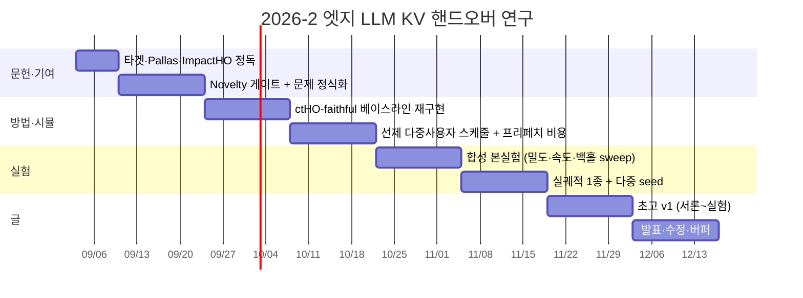

# 2026-2학기 연구 계획서

> 대상: 초안 PR [#1](https://github.com/yelim0522/alpha-project/pull/1)
> 기간: 2026-09-03 ~ 2026-12-16 (약 15주, 3.5개월)
> 방식 B: 타겟 논문 1편([Lee et al., arXiv:2603.28018](https://arxiv.org/abs/2603.28018), 이하 **ctHO**)을 개선
> 현재 초안 버전: `paper/draft.md` v0.2

---

## 0. 한 줄 결론

**이번 주는 시뮬레이터를 키우거나 궤적을 받지 말고, 타겟 논문과 8월에 나온 두 후속 논문을 끝까지 읽고 novelty를 다시 적어라.**

초안의 “선제 프리페치” 아이디어는 방향은 맞지만, 그 사이 [Pallas (arXiv:2608.16477, 8/17)](https://arxiv.org/abs/2608.16477)가 **핸드오버 이전 KV 준비**를 이미 제안했다. 지금 바로 실험을 키우면 나중에 기여가 겹친다는 걸 알고 처음부터 다시 하게 된다. 2주 안에 “Pallas가 안 하는 결정”을 한 문단으로 못 쓰면, 실험에 들어가지 않는다.

---

## 1. 지금 초안이 서 있는 위치

이미 있는 것:

- 문제 축은 맞다. MEC × LLM × 이동성에서 **KV 캐시를 전송할지 재계산할지**.
- 타겟은 맞게 골랐다. ctHO는 다중 사용자에 대해 prefill 길이 \(L\)과 백홀 스케줄 \(r(\cdot)\)을 같이 풀어 최악 사용자 지연을 최소화한다.
- 파일 골격이 있다. `paper/draft.md`, `paper/references.md`, `sim/` 파일럿.

아직 연구가 아닌 것:

- `sim/`의 `reactive-hybrid`는 사용자마다 \(p^\star=\frac{c v L}{B+c v}\)를 고르는 **단사용자 근사**다. ctHO의 핵심인 **공통 배치 prefill 길이 + 최악 사용자 목적함수 + 누적 잔여량 \(S_k(L)\) 기반 속도 할당**이 없다.
- 파일럿 개선폭이 작다. 평균 1.481s → 1.415s, **p99는 둘 다 1.836s**, 핑퐁 횟수는 네 정책이 전부 81회로 같다. “구조적 한계를 넘었다”고 쓰기엔 부족하다.
- 프리페치가 백홀을 쓰는 비용이 모델에 없다. 선제 전송을 공짜로 앞당긴 셈이라, 혼잡을 평탄화했다고 주장하기 어렵다.
- 이동은 랜덤 웨이포인트, 대화 길이는 균등 난수다. 본실험 주장에 쓸 수 없다.

초안 TODO(실제 궤적, LMSYS 분포, 다중 seed)는 **3단계 이후**의 일이다.

---

## 2. 이번 학기에 바뀐 판 (반드시 읽고 시작)

초안은 2026-07-12에 쓰였다. 그 뒤 같은 타겟을 직접 인용하는 논문이 두 편 나왔다.

| 논문 | 시기 | 결정 시점 | 다중 사용자 | 목적 | 본 초안과의 관계 |
|---|---|---|---|---|---|
| **ctHO** (타겟) | 2026-03 | 핸드오버 **이후** (hard HO) | 예 (최악 지연 min) | 지연 | 개선 대상. 미래 작업으로 soft HO를 스스로 적어 둠 |
| **ImpactHO** | 2026-08-10 | 핸드오버 **이후** | 예 (슬롯별 water-filling) | **부분 캐시 정확도** | 문제 축이 다름. 지연이 아니라 정확도. 다만 “동시 핸드오버가 백홀을 고갈시킨다”는 관찰은 공유 |
| **Pallas** | 2026-08-17 | 핸드오버 **이전** | **아니오** (명시적으로 범위 밖) | 중단시간 SIT + ITL | **현재 초안의 기법과 가장 겹침** |

Pallas가 초안 novelty를 직접 위협하는 문장:

- ctHO·재계산·전량전송은 모두 “복구가 **핸드오버 뒤에** 시작된다”는 같은 시간 구조를 가진다.
- 그래서 Pallas는 예측된 타깃에서 **프리페치 윈도우** 동안 prefix prefill + suffix KV 스트리밍을 한다.
- 그러면서도 “동시 마이그레이션 간 GPU·백홀의 **결합 할당은 범위 밖**”이라고 적는다.

ctHO 결론의 미래 작업:

- hard HO를 **soft HO**로 확장한다. 타깃이 미리 계산하고 소스는 디코딩을 이어 간다.

즉 학기 시작 시점의 빈칸은 “프리페치를 한다”가 아니다. 빈칸은 다음이다.

> **여러 사용자가 겹쳐 움직일 때, 핸드오버 이전에 누구의 KV를 얼마나·어느 링크로 옮길지를 같이 정하는 일.**
> Pallas는 시점을 앞당겼지만 경합 할당을 안 하고, ctHO는 경합 할당을 하지만 시점이 이벤트 이후이다.

이 문장이 2주차 게이트를 통과하지 못하면, 기여를 더 좁히거나(예: 예측 오차 하 다중 타깃 예약, 프리페치 자체의 혼잡 가격) 축을 옮긴다.

관련 비교의 상세는 `paper/related-work-map.md`.

---

## 3. 이번 주(9/3–9/9)에 할 일 — 이 순서대로

매일 2–4시간을 가정한 1주 치다. 건너뛰지 말 것.

### Day 1–2. 타겟 논문을 수식으로 다시 읽기

[ctHO HTML](https://arxiv.org/html/2603.28018)을 초록이 아니라 **II–III절**까지 읽는다. 읽으면서 공책에 아래만 손으로 다시 쓴다.

1. 사용자 \(i\)의 잔여 KV: \(n_i^{\mathrm{(tx)}}(L)=(C_i-L)^+\)
2. 최악 지연: \(D=\max_i \max\{D_i^{\mathrm{(pf)}}, D_i^{\mathrm{(tx)}}\}\)
3. 누적 잔여 \(S_k(L)\)와 \(D_{(\mathrm{tx})}^\star(L)=\max_k [S_k(L)/R-(\tau_k-\tau_1)]^+\)
4. 최적 \(L\)은 \(D^{(\mathrm{pf})}(L)=D_{(\mathrm{tx})}^\star(L)\)가 되는 지점
5. 실험 설정: \(K=4\), 1차원 도로, Qwen2.5-7B, \(s_{\mathrm{KV}}=458{,}752\) bit/token (약 56 KB/token)

초안의 \(D_k(p)=\max(p/v_m,\,c(L_k-p)/B)\)는 **단사용자·공유 \(L\) 없음·최악이 아닌 평균**이다. 이 차이를 한 페이지로 적는 것이 첫 산출물이다 (`paper/notes/ctho-reconstruction.md`로 두어도 된다).

### Day 3. Pallas를 “겹침 점검”으로 읽기

[Pallas](https://arxiv.org/pdf/2608.16477)에서 아래만 표시한다.

- 프리페치 윈도우 \(\Delta\)의 트레이드오프 (짧으면 SIT, 길면 idle·suffix 증가)
- prefix prefill ∥ suffix KV 스트리밍
- 예측이 틀렸을 때의 fallback
- **다중 사용자 할당을 안 한다는 문장** (Scheduler Engine 절 근처)

읽은 뒤 초안 4절을 한 줄씩 대조한다. “선형 외삽 + 점진 전송”은 Pallas의 특수 사례에 가깝다. 살아남는 문장만 남긴다.

### Day 4. ImpactHO로 목적함수 축을 구분하기

[ImpactHO](https://arxiv.org/html/2608.10545v1) I절·Table I만 읽어도 된다. 핵심은 “같은 백홀 경합을 **정확도 최대화**로 푼다”는 점이다. 우리 목적함수가 지연(SIT/최악 지연)인지, 정확도인지, 둘 다인지를 Day 4 저녁에 고정한다. 학기 과제라면 **지연 하나**로 가는 편이 안전하다.

### Day 5. 1페이지 novelty 메모 (게이트 초안)

아래 네 칸을 채운다. 빈칸이면 다음 주로 넘기지 말고 다시 읽는다.

```
(1) ctHO가 원리적으로 못 하는 결정:
(2) Pallas가 원리적으로 못 하는 결정:
(3) 이 연구가 그 교집합의 빈칸에서 하는 결정:
(4) 그걸 보여주는 최소 실험 하나 (어떤 축을 sweep하면 반응형·Pallas 근사가 깨지나):
```

권장 초안 (검증 전, 가설일 뿐):

> 다중 사용자 핸드오버 herding이 예상될 때, 프리페치 윈도우와 백홀 몫을 **사용자 간에 같이** 배정하여 첨두 대역폭을 시간축으로 분산한다. Pallas식 단세션 윈도우 선택과 ctHO식 이벤트 후 min-max 스케줄의 사이에 있는 결정이다.

### 이번 주에 하지 말 것

- T-Drive / Rome / Porto 궤적 다운로드
- LMSYS-Chat-1M 전처리
- `sim/`에 기능을 잔뜩 추가
- 초안 서론을 문장 단위로 다듬기
- GPU에서 실제 LLM 서빙을 돌리기 (학기 과제 범위 밖. 필요하면 11월 이후에나 검토)

---

## 4. 15주 일정

중간고사·기말고사 주간은 산출물을 줄이고 읽기·정리만 한다. 날짜는 일반적인 2학기 캘린더에 맞춘 권장값이며, 수업 일정에 맞게 한 주씩 밀어도 된다. **밀더라도 2주차 게이트와 8주차 본실험 착수는 지킨다.**



### 1단계. 문헌과 기여 고정 (W1–W3, 9/3–9/23)

| 주 | 날짜 | 목표 | 산출물 | 완료 기준 |
|---|---|---|---|---|
| W1 | 9/3–9/9 | 세 논문을 수식 단위로 읽기 | 읽기 노트 + 위 네 칸 초안 | ctHO III절을 보고 \(D_{(\mathrm{tx})}^\star\)를 설명 |
| W2 | 9/10–9/16 | **Novelty 게이트** | `paper/novelty-memo.md` 1–2쪽 | 지도/팀에서 “Pallas와 안 겹친다”는 답을 받거나, 스스로 반례를 적음 |
| W3 | 9/17–9/23 | 문제 정식화 | `draft.md` 3절을 ctHO 기호에 맞춰 재작성 | 목적함수·제약·결정변수가 한 곳에 있음 |

W2 게이트 탈락 시 대안 (미리 정해 둠):

- A. 다중 사용자 **선제 백홀 할당** (권장, Pallas 공백)
- B. 예측 오차·핑퐁이 있을 때 선제 예약의 **취소 비용** (Pallas fallback의 다중 사용자 확장)
- C. ImpactHO와 결합: 선제 구간에 중요도 순 부분 전송 (범위가 커져 학기 안에 위험)

A를 기본으로 두고, W2 금요일에만 B/C로 바꾼다.

### 2단계. 방법을 시뮬레이터에 심기 (W4–W7, 9/24–10/21)

| 주 | 날짜 | 목표 | 산출물 | 완료 기준 |
|---|---|---|---|---|
| W4 | 9/24–9/30 | ctHO를 있는 그대로 재구현 | `sim/policies.py`에 `ctho-minmax` | 같은 1D·\(K=4\) 설정에서 논문 Fig.3 경향(전량전송 ≫ 전량재계산 ≥ ctHO)이 재현 |
| W5 | 10/1–10/7 | 프리페치의 **백홀 비용**을 명시 | 매 스텝 잔여 대역폭에서 프리페치가 차감 | “공짜 선제 전송”이 사라짐 |
| W6 | 10/8–10/14 | 제안 정책: 다중 사용자 선제 할당 | 알고리즘 의사코드 1개 + 구현 | 입력: 예측 \(\hat\tau_k,\hat m_k\), 출력: 윈도우·속도 몫 |
| W7 | 10/15–10/21 | 통제실험 설계 확정 | 실험 카드 1장 | 아래 네 비교가 모두 돌아감 |

W7에 돌아가야 하는 네 정책:

1. `always-transfer` / `always-recompute` (극단)
2. `ctho-minmax` (타겟, 반응형 다중 사용자)
3. `pallas-single` (세션별 선제, 결합 할당 없음) — **꼭 넣을 것**. 없으면 Pallas와 차별을 못 보여 줌
4. `proposed` (선제 + 다중 사용자 결합 할당)

중간고사 주간이 끼면 W5–W6를 한 주 압축하고, 구현 범위는 “수식과 같은 휴리스틱”으로 유지한다. 강화학습·그래프 학습은 넣지 않는다. 초안의 zero-retraining 원칙을 지킨다.

### 3단계. 본실험 (W8–W11, 10/22–11/18)

파일럿에서 이미 드러난 실패를 먼저 고친다.

- p99가 안 줄어들면, 주 지표를 **최악 사용자 지연**과 **백홀 첨두(동시 전송량)**로 올린다. 평균만 보고 논문을 쓰지 않는다.
- 핑퐁 횟수가 정책과 무관하면, 핑퐁은 “구조적 증상”이 아니라 이동 모델의 부산물이다. 게이팅이 줄이는 것은 **헛된 프리페치 바이트**이지 핸드오버 횟수가 아니다. 지표를 그에 맞게 바꾼다.

| 주 | 날짜 | 실험 | 왜 이 순서인가 |
|---|---|---|---|
| W8 | 10/22–10/28 | 합성 고밀도·고이동성 sweep (유저 수, 속도, \(R_{\mathrm{bh}}\)) | herding이 실제로 생기는 구간을 찾아야 제안이 의미가 있음 |
| W9 | 10/29–11/4 | 예측 오차·핑퐁 민감도 | 선제의 값이 예측 품질에 묶여 있음을 정직하게 보여 줌 |
| W10 | 11/5–11/11 | 실제 궤적 **1종만** (T-Drive 또는 Porto 중 하나) | 두 개 이상 받으면 전처리에 주가 사라짐 |
| W11 | 11/12–11/18 | seed 5개, 신뢰구간, 실패 케이스 정리 | “항상 이긴다”가 아니라 언제 지는지를 표로 |

대화 길이: LMSYS 전체 덤프 대신, 공개된 길이 히스토그램이나 소량 샘플로 \(C_i\) 분포만 맞춘다. 모델 가중치는 받지 않는다.

KV 크기 상수는 초안의 0.2 MB/token이 아니라 ctHO의 Qwen2.5-7B 값(약 56 KB/token) 또는 Pallas의 Qwen3-32B 값(256 KiB/token) 중 **하나를 고정**해 쓴다. 논문 간 숫자를 섞지 않는다.

### 4단계. 글과 발표 (W12–W15, 11/19–12/16)

| 주 | 날짜 | 목표 |
|---|---|---|
| W12 | 11/19–11/25 | `draft.md`를 서론–관련연구–모델–방법–실험 결과까지 v1 |
| W13 | 11/26–12/2 | 관련연구를 8월 논문 기준으로 다시 쓰기. 그림 3–4장 |
| W14 | 12/3–12/9 | 팀/수업 발표 슬라이드 10–12장. 질문 예상 리스트 |
| W15 | 12/10–12/16 | 피드백 반영, 재현 스크립트(`sim/run.py` 한 줄), 남은 TODO만 결론에 |

제출 형태가 수업 리포트면 LaTeX 변환은 W13에 하고, 학회 투고가 아니면 투고용 문장(“최초로”)을 쓰지 않는다.

---

## 5. 주간 운영 (작게 유지)

- **월:** 그 주 가설 한 문장. 예: “사용자 80명·속도 40에서 ctHO 대비 최악 지연이 줄어드는가.”
- **수:** 구현 또는 실험 중간 로그를 `sim/` 출력 그대로 커밋.
- **금:** 30분 회고. 가설이 틀렸으면 다음 주 실험을 바꾸고, 초안 문장을 고치지 않음.
- 지도교수/팀 미팅이 있으면 W2(기여 문장), W7(실험 카드), W12(초고) 세 번만 안건으로 가져간다.

하루 상한: 평일 2–3시간, 시험 주 1시간. 이 계획이 수업·시험과 싸우면 실험 축을 줄인다. 문헌 게이트와 `pallas-single` 베이스라인은 줄이지 않는다.

---

## 6. 학기 말 최소 산출물

Must (이게 없으면 연구가 안 끝남):

1. Pallas를 포함한 관련연구 재배치와 1문단 기여
2. ctHO에 가까운 반응형 베이스라인 + Pallas식 단세션 선제 베이스라인 + 제안
3. herding이 보이는 구간에서 최악 지연·백홀 첨두 비교 (다중 seed)
4. 재현 가능한 `sim/`과 실험 표

Nice (시간 되면):

- 실제 궤적 1종
- 프리페치 발동률 vs 이득의 인과 플롯
- 수업 발표 슬라이드

Out of scope (이번 학기 금지):

- vLLM 실기 프로토타입 (Pallas가 이미 함)
- 새로운 학습 기반 이동 예측기
- 모델 분할·오프로딩 (팀원 초안과 축이 겹침)
- 궤적 데이터셋 3종 이상

---

## 7. 리스크와 대응

| 리스크 | 조기 신호 | 대응 |
|---|---|---|
| Pallas와 기여 충돌 | W2에 차별 문장이 기법 나열로 변함 | 다중 사용자 결합 할당으로 좁힘 |
| 파일럿처럼 이득이 평균만 소폭 | W8 sweep에서 p99/최악이 안 움직임 | 고경합 구간만 남기고, 저이동성은 “개입하지 않음”으로 보고 |
| ctHO 재구현이 논문과 안 맞음 | W4에 Fig.3 경향이 안 나옴 | 1D·\(K=4\)로 축소해 수식부터 다시. 2D 그리드는 나중에 |
| 궤적 전처리에 주가 사라짐 | W10에 파싱만 하고 있음 | 합성 실험으로 본문을 쓰고 궤적은 appendix |
| 시험 주간 | 산출물 0 | 읽기 노트만. 일정은 W5/W6를 압축 |

---

## 8. 바로 열리는 링크

- 타겟: https://arxiv.org/abs/2603.28018
- Pallas: https://arxiv.org/abs/2608.16477
- ImpactHO: https://arxiv.org/abs/2608.10545
- 초안: `paper/draft.md`
- 비교표: `paper/related-work-map.md`
- 시뮬레이터: `sim/README.md`
